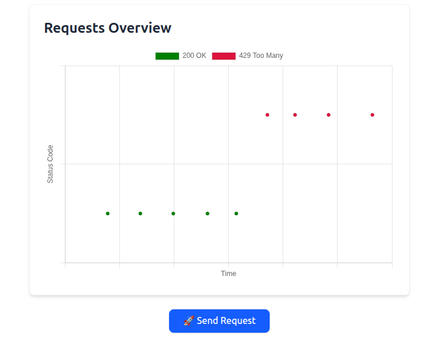

# 🚦 Distributed Rate Limiter (Ruby on Rails 8)

A simple and visual **distributed rate limiter** built with **Ruby on Rails 8**, using **Redis** for state tracking, **Docker**, **Rack middleware**, and a **Turbo + Chart.js** frontend.

## 🧠 What It Does

This app simulates API request handling with a rate limiter that:

- Blocks requests after a set threshold within a time window
- Provides live feedback through flash messages and charts
- Lets users configure `max_per_window` and `window_size`
- Uses a custom **Rack middleware** to enforce rate limiting early in the request lifecycle

## 🛠️ Tech Stack

- **Ruby on Rails 8**
- **Redis** – in-memory rate limit store
- **Docker / Docker Compose** – dev environment
- **Hotwire (Turbo + Stimulus)** – reactive frontend
- **Chart.js** – data visualization
- **Tailwind CSS** – styling
- **Custom Rack Middleware** – rate limiting logic

## 🚀 Live Demo

Coming soon.

## 📸 Screenshots

### 🏠 Home Page


### 📊 Chart After Requests


### ⚙️ Settings Form


## ⚙️ Configuration

You can adjust the rate limiter settings on the web UI or via ENV:

```env
MAX_PER_WINDOW=5
WINDOW_SIZE=60
```

## 🧪 How to Use

### Clone the repo

```bash
git clone https://github.com/joaquin-peralta/rate-limiter-demo.git
cd rate-limiter-demo
```

### Start the app (Docker required)
`docker-compose up --build`

### Access the UI
Visit http://localhost:8000 in your browser.

Use the "Send Request" button to simulate API hits.

View request data live in the chart.

Update rate limiting settings in the form on the home page.

## 📦 Scaling the App with Docker Compose

This app is Dockerized and supports **horizontal scaling** (e.g., running multiple `web` instances). This can be useful for:

- Simulating distributed request handling
- Stress-testing the rate limiter under concurrent loads

---

### 🔧 How to Scale the `web` Service

To run **multiple instances** of the Rails web app, follow these steps:

#### 1. ✅ Uncomment the shared `/app/tmp` volume line

In `docker-compose.yml`, under the `x-app` section:

```yaml
volumes:
  - "${DOCKER_WEB_VOLUME:-./public:/app/public}"
  - /app/tmp  # <-- Uncomment this line
```

This prevents temp files like `server.pid` from clashing between containers.

> 📌 **Note:** Without this, multiple Rails containers may fail to start due to a "server already running" PID error.

---

### 🔀 Enable random port assignment (if needed)

If you're scaling and want each container to bind to a different port (instead of all trying to use `8000`), replace this line under the `web` service:

```yaml
- "${DOCKER_WEB_PORT_FORWARD:-127.0.0.1:8000}:${PORT:-8000}"
```

With

```yaml
- "127.0.0.1::${PORT:-8000}"
```
This allows Docker to assign random available host ports while each container still listens on port 8000 internally.

### 📈 Scale the `web` service

To scale horizontally and run multiple instances of the Rails `web` container, use:

```bash
docker-compose up --scale web=2 --build
```

You can change the number `(web=2)` to however many instances you'd like.

> 💡 **Tip:** If you're using random port binding (`127.0.0.1::8000`), each instance will get a different host port. Use `docker ps` to check which ports were assigned.

## 🧠 What I Learned

- How to build and plug in custom Rack middleware
- Redis usage for distributed counter state
- Integrating Chart.js in Rails via Stimulus + Turbo
- Advanced Docker Compose setups with multiple services
- Styling interactive UIs with TailwindCSS

## 🔗 Links

- 💻 [GitHub Profile](https://github.com/joaquin-peralta)
- 🔗 [LinkedIn](https://linkedin.com/in/joaquin-peralta-1074291ba)
